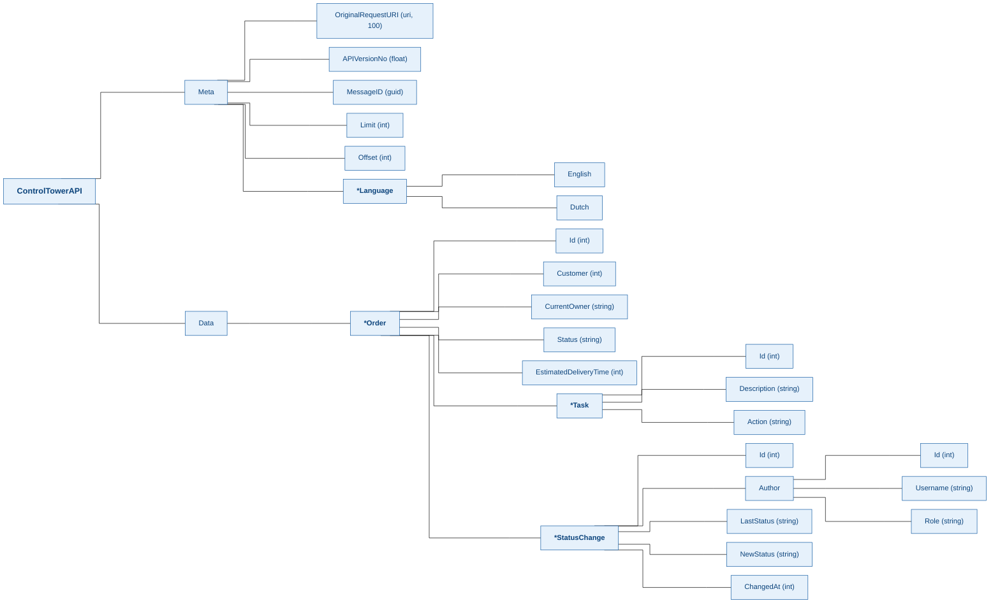

## Control tower logical data object tree

```mermaid
%%{init: {"theme": "base", "flowchart": {"curve": "step", "rankSpacing": 200, "nodeSpacing": 20}}}%%
flowchart LR
    root["ControlTowerAPI"]
    root --- n1["Meta"]
    n1 --- n2["OriginalRequestURI (uri, 100)"]
    n1 --- n3["APIVersionNo (float)"]
    n1 --- n4["MessageID (guid)"]
    n1 --- n5["Limit (int)"]
    n1 --- n6["Offset (int)"]
    n1 --- n7["*Language"]
    class n7 entity
    n7 --- n8["English"]
    n7 --- n9["Dutch"]
    root --- n10["Data"]
    n10 --- n11["*Order"]
    class n11 entity
    n11 --- n12["Id (int)"]
    n11 --- n13["Customer (int)"]
    n11 --- n14["CurrentOwner (string)"]
    n11 --- n15["Status (string)"]
    n11 --- n16["EstimatedDeliveryTime (int)"]
    n11 --- n17["*Task"]
    class n17 entity
    n17 --- n18["Id (int)"]
    n17 --- n19["Description (string)"]
    n17 --- n20["Action (string)"]
    n11 --- n21["*StatusChange"]
    class n21 entity
    n21 --- n22["Id (int)"]
    n21 --- n23["Author"]
    n23 --- n24["Id (int)"]
    n23 --- n25["Username (string)"]
    n23 --- n26["Role (string)"]
    n21 --- n27["LastStatus (string)"]
    n21 --- n28["NewStatus (string)"]
    n21 --- n29["ChangedAt (int)"]
    classDef default fill:#E6F1FB,stroke:#185FA5,color:#0C447C,stroke-width:1px
    classDef rootc fill:#E6F1FB,stroke:#185FA5,color:#0C447C,font-weight:bold,font-size:18px
    classDef entity font-weight:bold
    class root rootc
```