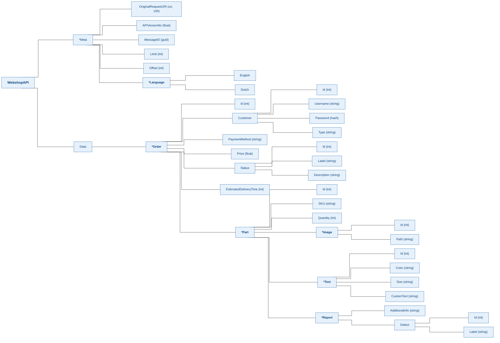

## Webshop logical data object tree

```mermaid
%%{init: {"theme": "base", "flowchart": {"curve": "step", "rankSpacing": 200, "nodeSpacing": 20}}}%%
flowchart LR
    root["WebshopAPI"]
    root --- n1["*Meta"]
    n1 --- n2["OriginalRequestURI (uri, 100)"]
    n1 --- n3["APIVersionNo (float)"]
    n1 --- n4["MessageID (guid)"]
    n1 --- n5["Limit (int)"]
    n1 --- n6["Offset (int)"]
    n1 --- n7["*Language"]
    class n7 entity
    n7 --- n8["English"]
    n7 --- n9["Dutch"]
    root --- n10["Data"]
    n10 --- n11["*Order"]
    class n11 entity
    n11 --- n12["Id (int)"]
    n11 --- n13["Customer"]
    n13 --- n14["Id (int)"]
    n13 --- n15["Username (string)"]
    n13 --- n15b["Password (hash)"]
    n13 --- n16["Type (string)"]
    n11 --- n17["PaymentMethod (string)"]
    n11 --- n18["Price (float)"]
    n11 --- n19["Status"]
    n19 --- n20["Id (int)"]
    n19 --- n21["Label (string)"]
    n19 --- n22["Description (string)"]
    n11 --- n23["EstimatedDeliveryTime (int)"]
    n11 --- n24["*Part"]
    class n24 entity
    n24 --- n25["Id (int)"]
    n24 --- n26["SKU (string)"]
    n24 --- n27["Quantity (int)"]
    n24 --- n28["*Image"]
    class n28 entity
    n28 --- n29["Id (int)"]
    n28 --- n30["Path (string)"]
    n24 --- n31["*Text"]
    class n31 entity
    n31 --- n32["Id (int)"]
    n31 --- n33["Color (string)"]
    n31 --- n34["Size (string)"]
    n31 --- n35["CustomText (string)"]
    n24 --- n36["*Report"]
    class n36 entity
    n36 --- n37["AdditionalInfo (string)"]
    n36 --- n38["Defect"]
    n38 --- n39["Id (int)"]
    n38 --- n40["Label (string)"]
    classDef default fill:#E6F1FB,stroke:#185FA5,color:#0C447C,stroke-width:1px
    classDef rootc fill:#E6F1FB,stroke:#185FA5,color:#0C447C,font-weight:bold,font-size:18px
    classDef entity font-weight:bold
    class root rootc
```
